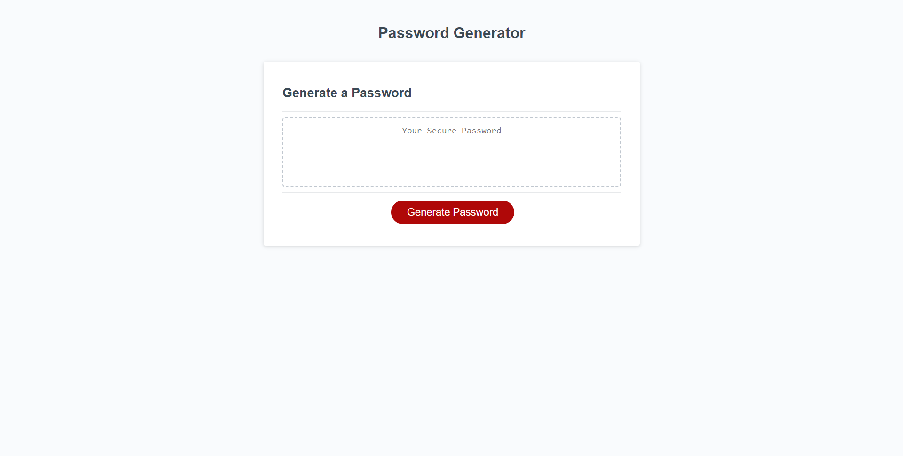

# Password Generator

## Description
A simple password generator that prompts the user to specify a certain criteria when generating the password such as length and character types. The password can be anywhere from 8 characters to a maximum of 128 characters and include/exclude lowercase, uppercase, numerical, and special characters. This project features many javascript concepts that I have learned such as arrays, objects, if-else statements, as well as a couple extra concepts that I searched for on my own.

## Installation
N/A

## Usage
The password generator can be accessed [here](https://brian-lascuna.github.io/password-generator/).

The password generator webpage should look like the following:

Clicking the "Generate Password" button will prompt the user for a length, acceptable values ranging from 8 to 128. The user will then be prompted for character types to be included/excluded with a final confirmation at the end. Confirming will generate a new password based on the user's criteria which will be shown on screen. The user may generate as many passwords as they please.

## Credits
N/A

## License
N/A
